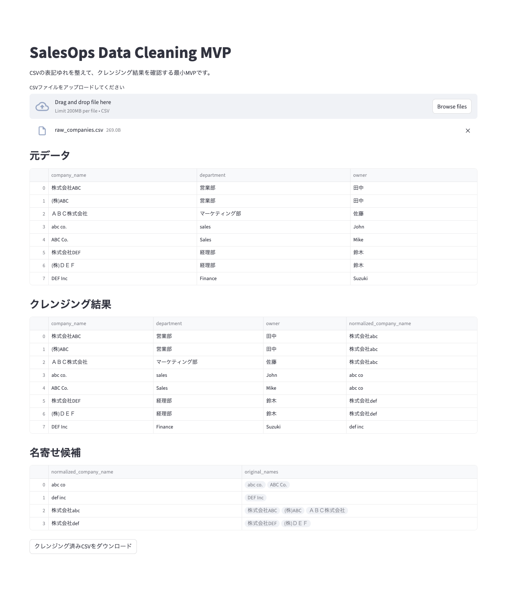

# SalesOps Data Cleaning MVP

表記ゆれのある企業データをクレンジング、  
名寄せ候補を可視化、  
クレンジング済みCSVを出力・保存するMVPです。  
非エンジニアでも理解しやすい操作性を意識しつつ、  
Terraformによるインフラ構築、  
Pythonによるデータ処理、  
StreamlitによるUI化を組み合わせて構築しました。

### 実装方法：AI活用によるMVP開発（AIペアプログラミング）

AIをペアプログラマーとして活用し、以下のプロセスで実装を行いました。

対話型設計：  
AIと壁打ちを行い、目的に最適化された技術選定と設計を実行

伴走型学習：  
コードの仕組みやエラーの解決法をAIから学びつつ、自身の手で実装

垂直立ち上げ：  
未経験の言語や技術であっても、AIを駆使し短期間で動くものを作る開発スピードの追求

---

## デモ画面(スクリーンショット)

---

## 1. ビジネス課題

営業・マーケティング・CRM運用の現場では、  
同じ企業にもかかわらず入力の違いによって  
別会社として登録されることがあります。

例:
- 株式会社ABC
- (株)ABC
- ＡＢＣ株式会社
- ABC Co.

このような表記ゆれがあると、以下の問題が起きます。

- 企業数や案件数の集計が正しく出ない
- 同じ会社に重複営業してしまう
- 顧客分析やセグメント分析がずれる
- CRMやスプレッドシート間の統合精度が下がる
- 最終的に人手での確認・修正コストが増える

---

## 2. 解決方法

このMVPでは、  
CSV内の `company_name` 列を対象に、以下の流れで表記ゆれを整えます。

1. CSVをアップロード
2. 会社名を正規化
   - 全角半角の差を吸収
   - 大文字小文字の差を吸収
   - `(株)` と `株式会社` を統一
   - 記号を除去
   - `ＡＢＣ株式会社` → `株式会社abc` のように語順も一部統一
3. 正規化後の会社名でグルーピング
4. 名寄せ候補を表示
5. クレンジング済みCSVをダウンロード
6. クレンジング済みCSVをGCSに保存

---

## 3. このMVPでできること

- CSVアップロード
- 会社名の表記ゆれ正規化
- 名寄せ候補のグルーピング表示
- クレンジング済みCSVの出力
- クレンジング済みCSVのGoogle Cloud Storage保存
- ブラウザ上での簡易操作

---

## 4. 構成

このMVPは、以下の3層で構成しています。

### A. インフラ
Terraformで、  
クレンジング済みCSVの保存先となる  
Google Cloud Storage バケットを作成しました。

### B. データ処理
Python + pandas でCSVを読み込み、  
会社名の表記ゆれを正規化し、名寄せ候補を抽出しました。

### C. UI
Streamlitで、  
非エンジニアでも操作しやすい最小UIを実装しました。

---

## 5. アーキテクチャ

```text
[User CSV Upload]
        |
        v
[Streamlit UI]
        |
        v
[Python / pandas cleaning logic]
        |
        +--> [Normalized preview]
        |
        +--> [Grouping result]
        |
        +--> [Cleaned CSV export]
        |
        +--> [GCS upload]

```

## 6. 技術スタック

### アプリケーション
- Python
- pandas
- Streamlit

### インフラ / クラウド
- Google Cloud Platform
- Google Cloud Storage (GCS)
- gcloud CLI

### IaC
- Terraform

### バージョン管理
- Git
- GitHub

---

## 7. Terraformでやったこと

このMVPでは、  
アプリ本体だけでなく、**保存先のクラウド基盤もコードで管理**しました。

### 実施内容
- Google Cloud provider を定義
- GCPプロジェクトを指定
- GCSバケットをコードで定義
- `terraform init`
- `terraform plan`
- `terraform apply`

### このMVPでのTerraformの役割
- クレンジング済みCSVの保存箱を作る
- 手動の画面操作ではなく、再現可能な形でクラウド資源を作る
- 変更内容を `plan` で事前確認する

### エンジニア目線で重要なポイント
- IaCでクラウド資源をコード管理している
- `terraform.tfstate` を Git 管理対象から除外している
- GCSバケットを手動ではなくTerraformで作成している
- `init / plan / apply` の基本フローを踏んでいる

---

## 8. Pythonでやったこと

Pythonでは、  
表記ゆれを比較可能な形に整える処理を実装しました。

### 主な処理
- CSV読み込み
- 会社名の正規化
- 正規化後の名前でグルーピング
- クレンジング済みCSV出力

### 正規化の具体例
- `株式会社ABC` → `株式会社abc`
- `(株)ABC` → `株式会社abc`
- `ＡＢＣ株式会社` → `株式会社abc`
- `ABC Co.` → `abc co`

### エンジニア目線で重要なポイント
- `unicodedata.normalize("NFKC", ...)` による全角半角吸収
- `lower()` による大文字小文字統一
- `re.sub()` による記号除去・空白整形
- pandas の `groupby()` による名寄せ候補の抽出
- CSV入出力をコードで再現可能にしている

---

## 9. Streamlitでやったこと

CLIでしか使えないデータ処理を、  
ブラウザで操作できる形にしました。

### 実装したUI機能
- CSVアップロード
- 元データ表示
- クレンジング結果表示
- 名寄せ候補表示
- クレンジング済みCSVダウンロード

### 非エンジニア向けの意味
Pythonスクリプトを直接実行しなくても、  
CSVをアップロードするだけで結果を画面確認できるようにしました。

### エンジニア目線で重要なポイント
- Streamlitによる最小UI実装
- pandas処理結果の可視化
- ダウンロード導線の実装
- CLIツールを簡易Webアプリへ変換している

---

## 10. ユーザーシナリオ

### シナリオ1: 営業企画担当
営業チームが管理している企業リストCSVをアップロードし、  
重複候補を確認する。  
同じ会社が別表記で登録されている箇所を発見し、  
クレンジング済みCSVをダウンロードしてCRM取り込み前の整備に使う。

### シナリオ2: マーケティングオペレーション担当
イベント参加企業データや見込み顧客リストを前処理し、  
企業単位の分析精度を上げる。  
表記ゆれ補正により、重複集計や分析のズレを減らす。

---

## 11. このMVP（AIペアプログラミング）で経験したこと

- ビジネス課題に対してのプロダクト設計・整理を行なった
- 最小構成で解決方法を設計した
- Pythonでデータ処理した
- Streamlitでブラウザ操作できる形にした
- Terraformで保存先インフラをコード化した
- エラーハンドリングに対する対処法や思考を学んだ（どこが問題かをステップバイステップで潰していく）
